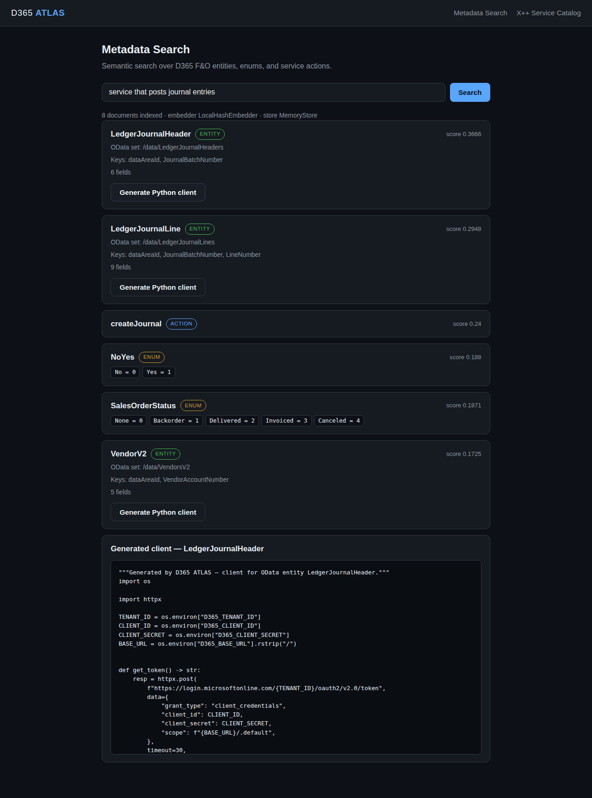
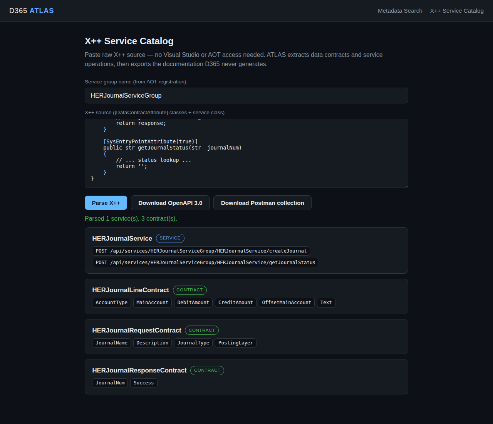
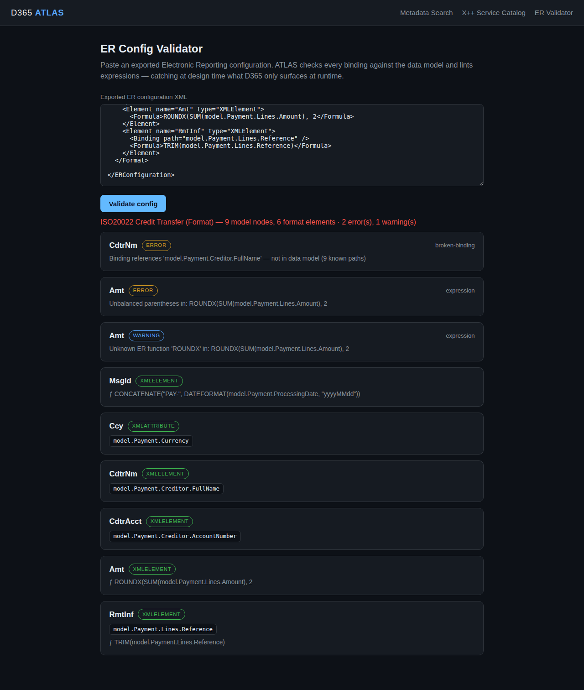
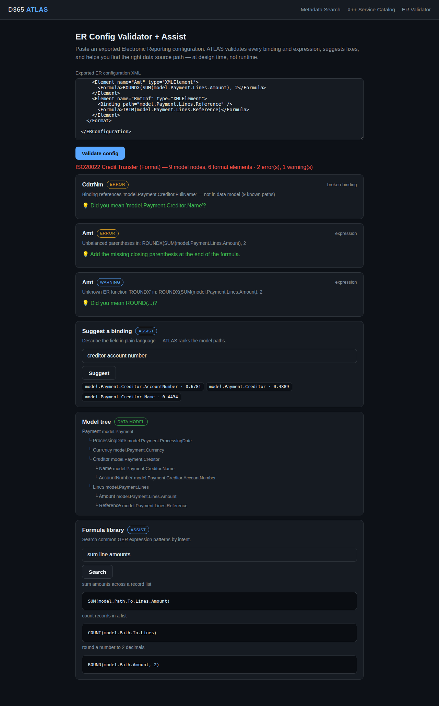

# Atlas — Test Evidence Log

Automated end-to-end evidence, captured on each commit. Screenshots live in `evidence/`.

---

## Run 1 — 2026-07-05T08:39:28Z — Standalone packaging + full E2E

**Commit:** initial standalone extraction (`Atlas-D365fo/`)

### Backend — pytest + ruff

```
$ python3 -m pytest tests/ -q
22 passed, 1 warning in 0.99s

$ python3 -m ruff check app/ tests/
All checks passed!
```

| Suite | Result |
|-------|--------|
| `test_edmx.py` — EDMX parser (entities/enums/actions) | ✅ pass |
| `test_embedder.py` — deterministic local embedder | ✅ pass |
| `test_api.py` — ingest / search / generate e2e | ✅ pass |
| `test_xpp.py` — X++ parse + OpenAPI + Postman | ✅ pass |
| **Total** | **22 passed** |

### Frontend — build + Playwright UI journey

```
$ npm run build
✓ Compiled successfully  (/ and /xpp prerendered as static content)

$ node evidence_test.mjs
PASS — Search 'service that posts journal entries': top result = LedgerJournalHeader
PASS — Generate Python client: code header = """Generated by D365 ATLAS — client for OData entity LedgerJ...
PASS — Parse X++ HERJournalService: 1 service, 3 contracts parsed
PASS — OpenAPI + Postman export buttons: visible = true
ALL UI CHECKS PASSED
```

**Screenshot — metadata search + generated Python client:**



**Screenshot — X++ service catalog + OpenAPI/Postman export:**



### Container entrypoint

Docker image build requires pulling `python:3.11-slim`, which is **blocked by this
sandbox's egress policy** (Docker Hub returns 403). The daemon starts fine; the pull is
the blocker. The container's exact runtime command was therefore verified directly:

```
$ uvicorn app.main:app --host 0.0.0.0 --port 8000 --workers 1   # Dockerfile CMD verbatim
$ curl http://127.0.0.1:8000/health
{"status":"ok","documents":0,"embedder":"LocalHashEmbedder","store":"MemoryStore",...}

# Dockerfile HEALTHCHECK probe:
exit 0 | status 200
```

The image builds normally on any machine with Docker Hub access (`docker build -t atlas-backend .`).

### Summary

| Check | Status |
|-------|--------|
| Backend unit + e2e tests (22) | ✅ |
| Ruff lint | ✅ |
| Frontend production build | ✅ |
| UI search → generate journey | ✅ |
| UI X++ parse → export journey | ✅ |
| Container CMD + healthcheck | ✅ (image pull blocked by sandbox egress) |

**All achievable checks passed.**

---

## Run 2 — 2026-07-05T09:36:28Z — Sprint 4: ER Config Validator

**Commit:** ER module (parser + binding/expression validators + /er UI)

### Backend — pytest + ruff

```
$ python3 -m pytest tests/ -q
29 passed, 1 warning in 0.54s      # +7 new ER tests

$ python3 -m ruff check app/ tests/
All checks passed!
```

### What the ER module catches (fixture has 2 intentional defects)

| Element | Finding | Severity |
|---------|---------|----------|
| `CdtrNm` | Binding references `model.Payment.Creditor.FullName` — not in data model | error |
| `Amt` | Unbalanced parentheses in formula | error |
| `Amt` | Unknown ER function `ROUNDX` | warning |
| `Ccy`, `MsgId`, `RmtInf`, `CdtrAcct` | valid — no findings | — |

### Frontend — Playwright /er journey

```
PASS — ER summary line: 2 errors, 1 warning rendered
PASS — Broken binding surfaced: CdtrNm FullName visible = true
PASS — Expression error surfaced: unbalanced-paren visible = true
```

**Screenshot — ER validator with findings:**



> Fixture is shaped on the documented GER export structure. Validate against a
> real sandbox export (Organization administration → Electronic reporting →
> Exchange → Export) before production use — the parser tolerates unknown
> wrapper elements by scanning for `Node`/`Element`/`Binding`/`Formula`.

**All checks passed. Sprint 4 complete — all three research-confirmed pain points now have working modules.**

---

## Run 3 — 2026-07-05T18:42:16Z — Sprint 5: ER Assist (co-pilot)

**Commit:** ER Assist — fix suggestions, semantic binding search, formula library

### Backend — pytest + ruff

```
$ python3 -m pytest tests/ -q
36 passed, 1 warning in 0.66s      # +7 new ER Assist tests

$ python3 -m ruff check app/ tests/
All checks passed!
```

### What Assist adds on top of detection

| Capability | Example (from fixture) |
|-----------|------------------------|
| Binding fix suggestion | `model.Payment.Creditor.FullName` → "Did you mean 'model.Payment.Creditor.Name'?" |
| Function fix suggestion | `ROUNDX` → "Did you mean ROUND(...)?" |
| Semantic binding search | "creditor account number" → `model.Payment.Creditor.AccountNumber` ranked #1 |
| Formula library | "sum line amounts" → `SUM(model.Path.To.Lines.Amount)` |
| Model tree view | indented data-model hierarchy rendered on /er |

### Frontend — Playwright /er journey

```
PASS — Binding fix suggestion: Creditor.Name suggested = true
PASS — Function fix suggestion: ROUND suggested for ROUNDX = true
PASS — Binding search: AccountNumber ranked for 'creditor account number'
PASS — Formula library: SUM pattern returned for 'sum line amounts'
```

**Screenshot — ER Assist with suggestions, binding search, and formula library:**



**All checks passed. Sprint 5 complete — ER module now detects AND advises.**
